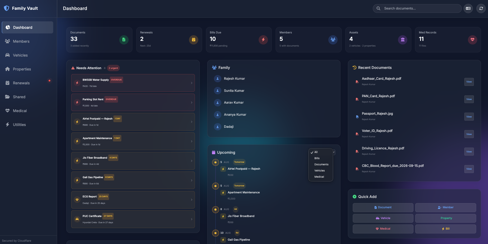
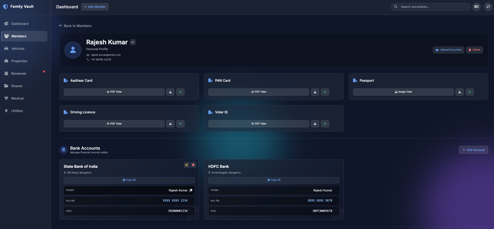
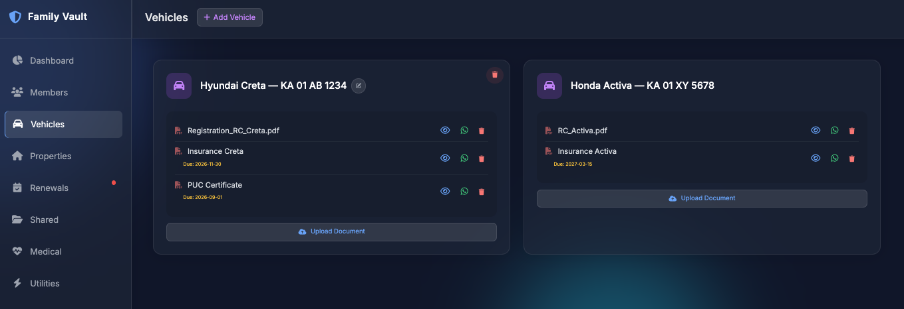
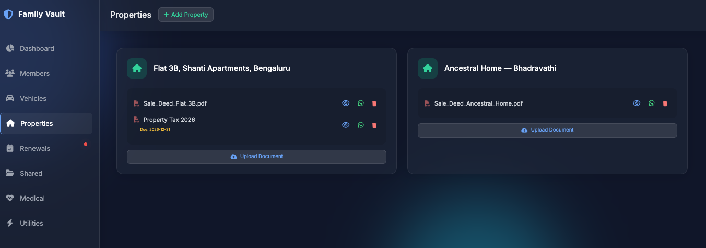
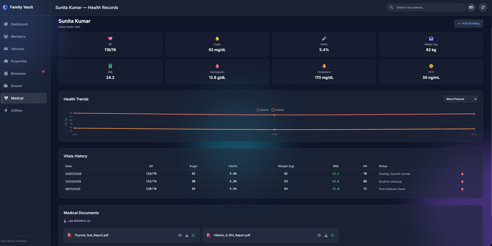
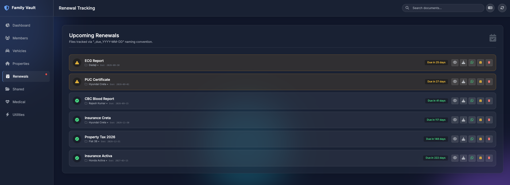
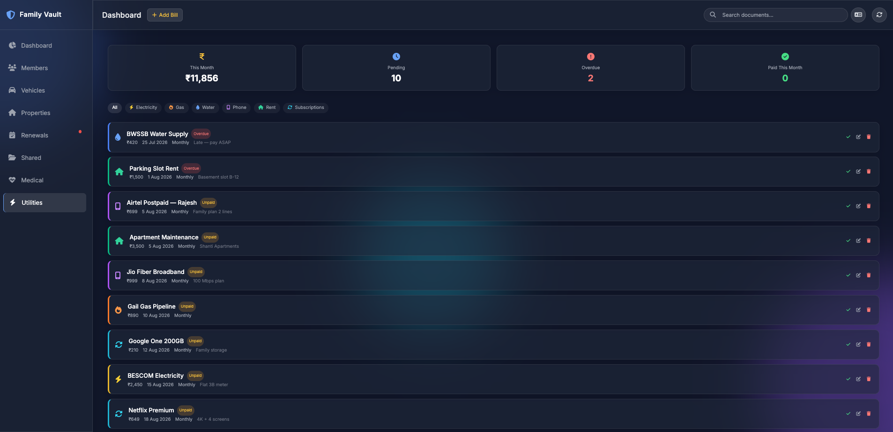

# 🛡️ ParivarVault — Family Document & Health Manager

> **A self-hosted, zero-trust family document + health records manager powered by your own Google Drive. PWA. Multi-language. Free forever.**
>
> Organize identity documents (Aadhaar, PAN, Passport), vehicle papers, property deeds, bank details, medical records, health vitals — and track renewals — all from a beautiful single-page dashboard. Your data stays in **your** Google Drive. No third-party servers. 🇮🇳

<p align="center">
  
  
  
  
  
  
</p>

---

## 📸 App Preview

<p align="center">
  
</p>

<details>
<summary><b>📸 Click to view all screenshots</b></summary>
<br/>

| | | |
|:---:|:---:|:---:|
| **👨‍👩‍👧‍👦 Family Members** | **🚗 Vehicles** | **🏠 Properties** |
|  |  |  |
| **🏥 Medical Vitals** | **⏰ Renewal Tracking** | **🏦 Utility & Bank** |
|  |  |  |

</details>

---

## ✨ Features

| | |
|:---|:---|
| 👨‍👩‍👧‍👦 **Family Members** | Store Aadhaar, PAN, Passport, Driving Licence, Voter ID, photos per person |
| 🚗 **Vehicles** | Track RC, Insurance, PUC certificates per vehicle |
| 🏠 **Properties** | Manage Sale Deeds, Property Tax documents |
| 🏦 **Bank Accounts** | Securely store IFSC, account numbers, branch info (local-only, never sent to any server) |
| ⏰ **Renewal Tracking** | Auto-detects `_due_YYYY-MM-DD` in filenames and shows expiry alerts |
| 🏥 **Medical Vitals** | Track BP, blood sugar, weight, BMI, heart rate per person with history |
| ✏️ **Full CRUD** | Add, edit, rename, delete members/vehicles/properties/documents — all syncs to Drive |
| 📸 **Profile Photos** | Upload photos for any family member; shown as thumbnails throughout the app |
| 🔍 **Universal Search** | Search across all documents instantly |
| 📱 **PWA + Offline** | Install on phone home screen. Works offline with cached data |
| 🎨 **Dark Mode UI** | Glassmorphism design with animated background |
| 🌐 **11 Languages** | English, हिन्दी, বাংলা, తెలుగు, मराठी, தமிழ், اردو, ગુજરાતી, ಕನ್ನಡ, മലയാളം, ଓଡ଼ିଆ |
| 💬 **WhatsApp Share** | One-tap share documents to family WhatsApp groups |
| 🔒 **Zero-Trust** | All document data comes from **your** Google Drive via **your** Google Apps Script |

---

## ⚡ Quick Start

| Step | What | Time |
|:---:|:---|:---:|
| 1 | **[Deploy Apps Script](docs/SETUP.md#step-1-deploy-the-google-apps-script-backend)** — Copy-paste `Code.gs` into Google Apps Script | 2 min |
| 2 | **[Configure](docs/SETUP.md#step-2-configure-the-app)** — Create `vault-config.json` with your script URL | 1 min |
| 3 | **[Open](docs/SETUP.md#step-3-open-the-app)** — `python3 -m http.server 8080` or deploy to Cloudflare | 1 min |

> 📖 **[Full Setup Guide →](docs/SETUP.md)** — Includes Cloudflare Pages deployment, Zero Trust authentication, custom domain setup, and FAQ.

---

## 🏗️ Architecture

```
Your Browser  ──HTTPS──▶  Google Apps Script (your account)  ──▶  Your Google Drive
                                                                    └── ParivarVault/
                                                                        ├── People/
                                                                        ├── Vehicles/
                                                                        ├── Properties/
                                                                        └── Shared_Documents/
```

**Key point**: The app never touches your actual files. It reads file _names and metadata_ from Drive, and shows previews via Google Drive's built-in viewer. All data stays in YOUR Drive. Everything lives inside a single `ParivarVault/` folder — your Drive root is never touched.

---

## 📁 Project Structure

```
ParivarVault/
├── index.html                   # Main PWA app
├── manifest.json                # PWA manifest
├── sw.js                        # Service Worker (offline support)
├── vault-config.example.json    # Config template
├── vault-config.json            # YOUR config (gitignored)
├── apps-script/
│   └── Code.gs                  # Google Apps Script backend
├── screenshots/                 # App screenshots
├── tests/
│   ├── test-runner.html         # Visual test runner
│   └── tests.js                 # 10 suites, 50+ tests
└── docs/
    ├── SETUP.md                 # Detailed setup & deployment
    ├── FILE-NAMING.md           # Document naming conventions
    └── TESTING.md               # Test suite documentation
```

---

## 📚 Documentation

| Document | Description |
|---|---|
| **[Setup Guide](docs/SETUP.md)** | Full deployment: Apps Script, Cloudflare Pages, Zero Trust, custom domain, FAQ |
| **[File Naming](docs/FILE-NAMING.md)** | Auto-categorization rules for identity, vehicle, property & medical docs |
| **[Testing](docs/TESTING.md)** | Running the test suite (10 suites, 50+ tests) |
| **[Contributing](CONTRIBUTING.md)** | Contribution guidelines |
| **[Security](SECURITY.md)** | Security policy & best practices |

---

## 🔒 Security

| Principle | Implementation |
|---|---|
| **Zero-Trust** | No backend. Data flows: Your Drive → Your Apps Script → Your Browser |
| **No API Keys** | Uses `DriveApp` (built into Apps Script). No console setup required |
| **Bank Data Local** | `vault-config.json` is local-only, never sent to any server |
| **Your Credentials** | Apps Script runs under YOUR Google account. You authorize it once |
| **No Tracking** | Zero analytics, zero telemetry, zero external logging |
| **HTTPS Only** | All Google API calls over HTTPS. Cloudflare provides free SSL |
| **Private by Default** | `.gitignore` keeps your config out of version control |

> ⚠️ **Self-hosting publicly without auth?** Add HTTP Basic Auth or use Cloudflare Access. See [SECURITY.md](SECURITY.md).

---

## 🇮🇳 Made for Indian Families

Designed with Indian document types: **Aadhaar**, **PAN**, **Voter ID**, **Driving Licence**, **RC Book**, **PUC**, **Property Deeds** — but fully customizable for any country.

---

## 🤝 Contributing

We welcome contributions! See [CONTRIBUTING.md](CONTRIBUTING.md) and [CODE_OF_CONDUCT.md](CODE_OF_CONDUCT.md).

Before submitting PRs, run the test suite: `open tests/test-runner.html`

---

## 📜 License

**Family Digital Vault Public License (FDVPL)** — Free for personal and family use. Commercial use requires permission. See [LICENSE](LICENSE).

> 💡 **In short**: Use it for your family — free, forever. Don't turn it into a paid SaaS without talking to us first.

---

## ⭐ Star History

If you find this useful, please ⭐ star the repo — it helps other families discover it!

